# 用例图文档 (Use Case Diagrams)

**项目名称**: DataETL2 — 通用数据 ETL 平台
**文档版本**: 1.0.0
**文档日期**: 2026-05-02
**文档状态**: 草稿 (Draft)

---

## 变更日志

| 日期 | 版本 | 变更内容 |
|------|------|---------|
| 2026-05-05 | 1.0.0 | 新增变更日志区块（图表内容无变化）|
| 2026-05-03 | 1.0.0 | 新增 SFTP 配置用例（UC-SFTP-01~04）；新增三条 Phase 1 序列图（文件上传入库、SFTP 拉取、Raw→DWD 执行）|
| 2026-05-02 | 0.1 | 初版：4 个 Actor、14 个用例，全局用例图 |

---

## 目录

1. [参与者定义](#1-参与者定义)
2. [用例列表](#2-用例列表)
3. [系统总览用例图](#3-系统总览用例图)
4. [子系统用例图](#4-子系统用例图)
5. [关键流程序列图](#5-关键流程序列图)
6. [用例规格说明](#6-用例规格说明)

---

## 1 参与者定义

### 1.1 主要参与者 (Primary Actors)

| Actor ID | 名称 | 说明 | 对应用户类别 |
|---------|------|------|------------|
| **A1** | 业务分析师 (Analyst) | 平台核心用户，使用可视化界面构建和运行管道，无需技术背景 | 业务分析师 |
| **A2** | 数据工程师 (DataEngineer) | 高级用户，构建复杂管道，使用 API 集成，编写自定义 SQL/Python 转换 | 数据工程师 |
| **A3** | 系统管理员 (Admin) | 管理用户权限、系统配置、监控平台健康 | 系统管理员 |

### 1.2 次要参与者 / 外部系统 (Secondary Actors)

| Actor ID | 名称 | 说明 |
|---------|------|------|
| **S1** | SFTP 服务器 (SFTPServer) | 服务商放置 CSV/Excel 文件的 SFTP 服务器，系统通过 paramiko 连接并拉取文件 |
| **S2** | 邮件服务 (EmailService) | 发送告警和报告通知的 SMTP 服务 |
| **S3** | SSO/LDAP 服务 (AuthProvider) | 企业身份认证提供商（Phase 2 功能）|
| **S4** | Webhook 接收方 (WebhookTarget) | 接收执行状态通知的外部系统（Slack/Teams 等，Phase 2 功能）|
| **S5** | 调度引擎 (SchedulerEngine) | Prefect 3.x 定时调度系统（Phase 2 功能）|

---

## 2 用例列表

### UC-1x 账户与认证

| 用例 ID | 用例名称 | 参与者 | 优先级 |
|---------|---------|-------|-------|
| UC-11 | 用户登录（账号密码） | A1、A2、A3 | M |
| UC-12 | 企业 SSO/LDAP 登录 | A1、A2、A3、S4 | S |
| UC-13 | 用户登出 | A1、A2、A3 | M |
| UC-14 | 修改密码 | A1、A2、A3 | S |

### UC-2x 数据源管理（Phase 1）

| 用例 ID | 用例名称 | 参与者 | 优先级 | Phase |
|---------|---------|-------|-------|-------|
| UC-21 | 创建数据源配置 | A1、A2 | M | 1 |
| UC-22 | 配置 SFTP 连接参数 | A1、A2 | M | 1 |
| UC-23 | 测试 SFTP 连通性 | A1、A2 | M | 1 |
| UC-24 | 浏览 SFTP 文件目录 | A1、A2 | M | 1 |
| UC-25 | 手动拉取 SFTP 文件入库（etl_raw） | A1、A2、S1 | M | 1 |
| UC-26 | 手动上传 CSV/Excel 文件入库（etl_raw） | A1、A2 | M | 1 |
| UC-27 | 预览文件字段和样本数据 | A1、A2 | M | 1 |
| UC-28 | 编辑/删除数据源配置 | A1、A2 | S | 1 |
| UC-29 | 浏览数据源列表 | A1、A2、A3 | M | 1 |

### UC-3x 管道配置

> Phase 1 使用表单 UI 配置；UC-32 可视化拖拽画布在 Phase 2 引入。

| 用例 ID | 用例名称 | 参与者 | 优先级 | Phase |
|---------|---------|-------|-------|-------|
| UC-31 | 配置字段映射规则（Raw→DWD） | A1、A2 | M | 1 |
| UC-32 | 批量导入字段映射（Excel 模板）| A1、A2 | M | 1 |
| UC-33 | 手动编辑单条字段映射规则 | A1、A2 | M | 1 |
| UC-34 | 配置过滤规则（字段+运算符+值）| A1、A2 | M | 1 |
| UC-35 | 配置 DWS 聚合规则（GROUP BY + 聚合函数）| A1、A2 | M | 1 |
| UC-36 | 配置 ADS 输出规则（字段选取+排序）| A1、A2 | M | 1 |
| UC-37 | 保存配置 | A1、A2 | M | 1 |
| UC-38 | 可视化拖拽画布设计管道（React Flow）| A1、A2 | S | 2 |
| UC-39 | 导入/导出管道配置（JSON/YAML）| A2、A3 | S | 2 |

### UC-4x 管道执行

| 用例 ID | 用例名称 | 参与者 | 优先级 |
|---------|---------|-------|-------|
| UC-41 | 手动触发管道执行 | A1、A2、S6 | M |
| UC-42 | 配置定时调度 | A1、A2 | M |
| UC-43 | 查看执行状态 | A1、A2、A3 | M |
| UC-44 | 取消执行中任务 | A2、A3 | S |
| UC-45 | 重试失败任务 | A1、A2 | S |
| UC-46 | 配置重试策略 | A2、A3 | S |

### UC-5x 监控与告警

| 用例 ID | 用例名称 | 参与者 | 优先级 |
|---------|---------|-------|-------|
| UC-51 | 查看执行历史列表 | A1、A2、A3 | M |
| UC-52 | 查看执行日志详情 | A2、A3 | M |
| UC-53 | 查看监控仪表盘 | A1、A2、A3 | S |
| UC-54 | 配置告警规则 | A2、A3 | M |
| UC-55 | 查看数据质量报告 | A1、A2 | S |
| UC-56 | 查看错误数据样本 | A2 | S |

### UC-6x 用户权限管理（Admin）

| 用例 ID | 用例名称 | 参与者 | 优先级 |
|---------|---------|-------|-------|
| UC-61 | 创建/管理用户账号 | A3 | M |
| UC-62 | 分配角色权限 | A3 | M |
| UC-63 | 创建/管理工作空间 | A3 | S |
| UC-64 | 管理 API Token | A2、A3 | S |

### UC-7x 系统管理（Admin）

| 用例 ID | 用例名称 | 参与者 | 优先级 |
|---------|---------|-------|-------|
| UC-71 | 配置系统参数 | A3 | M |
| UC-72 | 查看系统健康状态 | A3 | S |
| UC-73 | 查看审计日志 | A3 | S |

---

## 3 系统总览用例图

```mermaid
graph TD
    A1(["👤 业务分析师\nAnalyst"])
    A2(["👤 数据工程师\nDataEngineer"])
    A3(["👤 系统管理员\nAdmin"])

    subgraph DataETL2["🔲 DataETL2 系统边界"]
        subgraph Auth["账户与认证"]
            UC11["UC-11 用户登录"]
            UC12["UC-12 SSO/LDAP登录"]
        end

        subgraph Source["数据源管理"]
            UC21["UC-21 创建数据源连接"]
            UC22["UC-22 测试数据源连接"]
            UC25["UC-25 浏览数据源列表"]
        end

        subgraph Pipeline["管道设计"]
            UC31["UC-31 创建管道"]
            UC32["UC-32 可视化设计管道"]
            UC33["UC-33 配置转换节点"]
            UC34["UC-34 预览节点数据"]
            UC35["UC-35 保存/发布管道"]
            UC36["UC-36 从模板创建管道"]
        end

        subgraph Execution["执行与调度"]
            UC41["UC-41 手动触发执行"]
            UC42["UC-42 配置定时调度"]
            UC43["UC-43 查看执行状态"]
            UC44["UC-44 取消执行任务"]
            UC45["UC-45 重试失败任务"]
        end

        subgraph Monitor["监控与告警"]
            UC51["UC-51 查看执行历史"]
            UC52["UC-52 查看执行日志"]
            UC53["UC-53 查看监控仪表盘"]
            UC54["UC-54 配置告警规则"]
        end

        subgraph Admin["系统管理（Admin）"]
            UC61["UC-61 用户账号管理"]
            UC62["UC-62 分配角色权限"]
            UC71["UC-71 配置系统参数"]
            UC72["UC-72 系统健康状态"]
        end
    end

    A1 --> UC11
    A1 --> UC21
    A1 --> UC31
    A1 --> UC32
    A1 --> UC36
    A1 --> UC41
    A1 --> UC42
    A1 --> UC43
    A1 --> UC51
    A1 --> UC53

    A2 --> UC11
    A2 --> UC21
    A2 --> UC22
    A2 --> UC31
    A2 --> UC32
    A2 --> UC33
    A2 --> UC34
    A2 --> UC35
    A2 --> UC41
    A2 --> UC42
    A2 --> UC43
    A2 --> UC44
    A2 --> UC45
    A2 --> UC51
    A2 --> UC52
    A2 --> UC54

    A3 --> UC43
    A3 --> UC51
    A3 --> UC53
    A3 --> UC61
    A3 --> UC62
    A3 --> UC71
    A3 --> UC72
```

---

## 4 子系统用例图

### 4.1 管道设计子系统

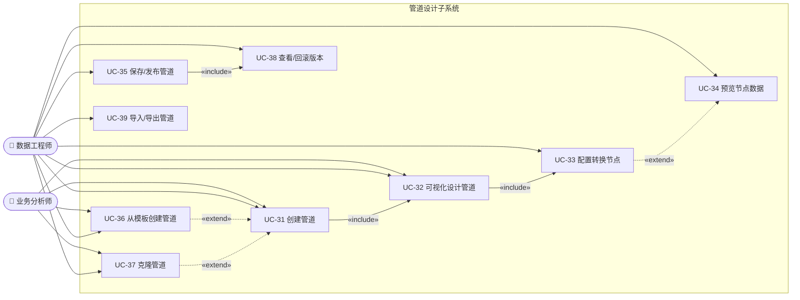

### 4.2 执行调度子系统

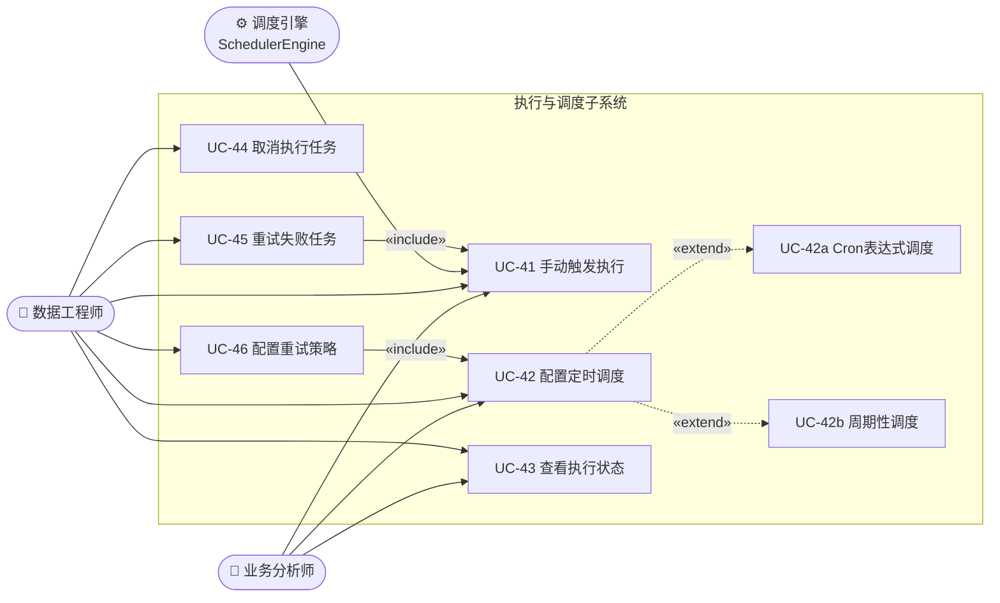

### 4.3 监控与告警子系统

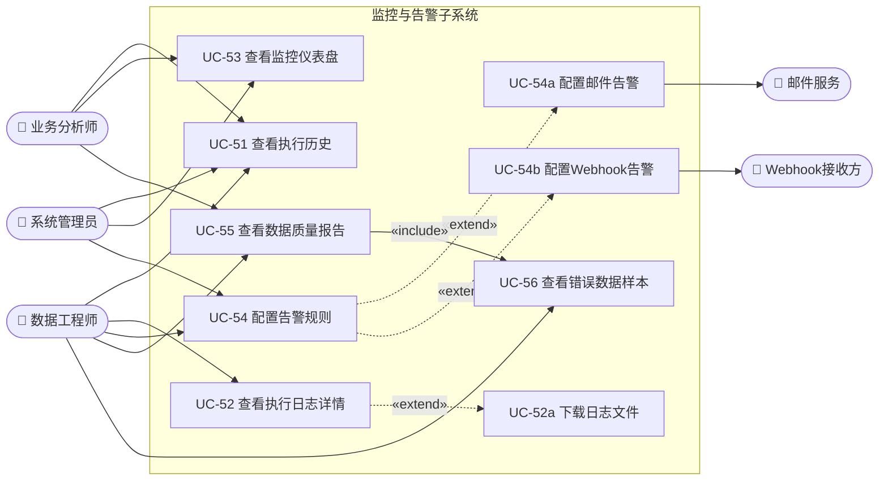

---

## 5 关键流程序列图

### 5.1 创建并执行管道（端到端主流程）

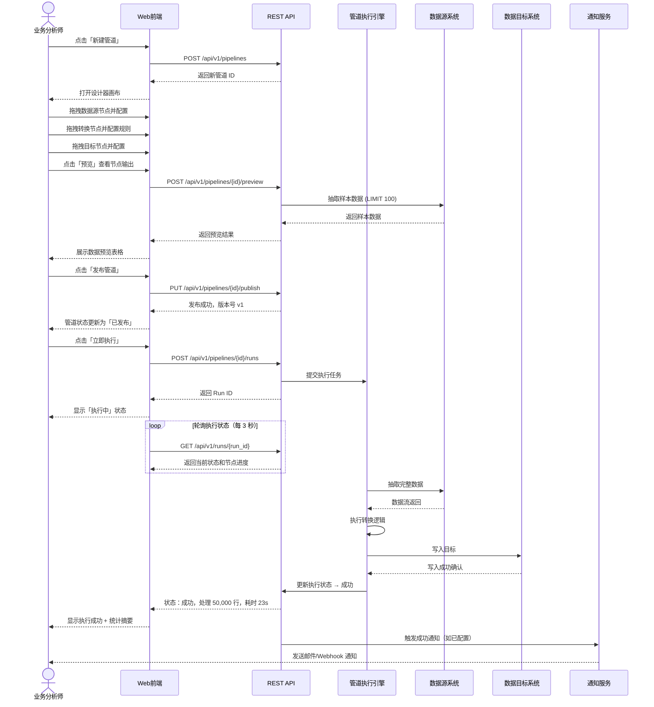

### 5.2 数据源配置与连接测试

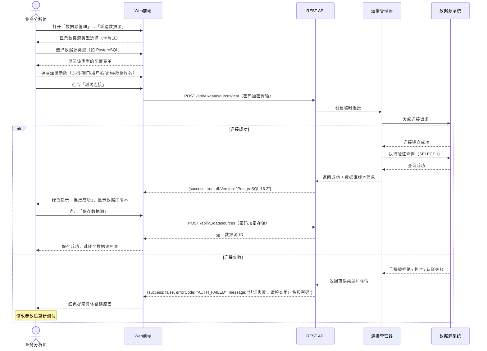

### 5.3 定时调度配置与失败告警

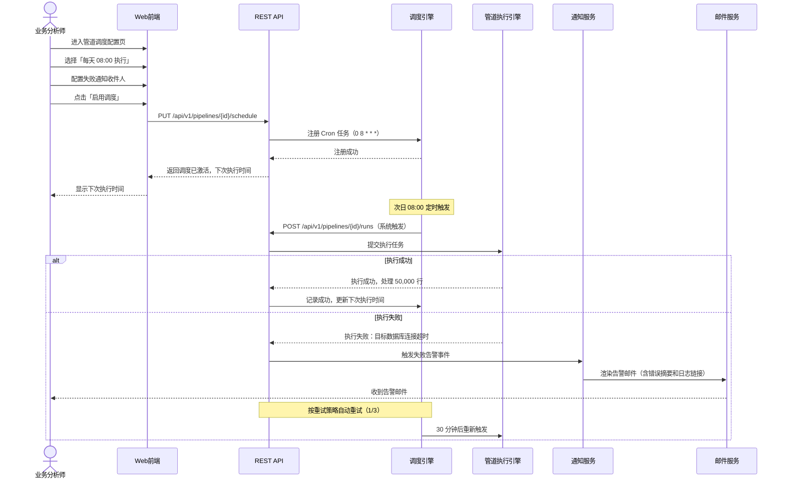

### 5.4 用户登录与权限验证

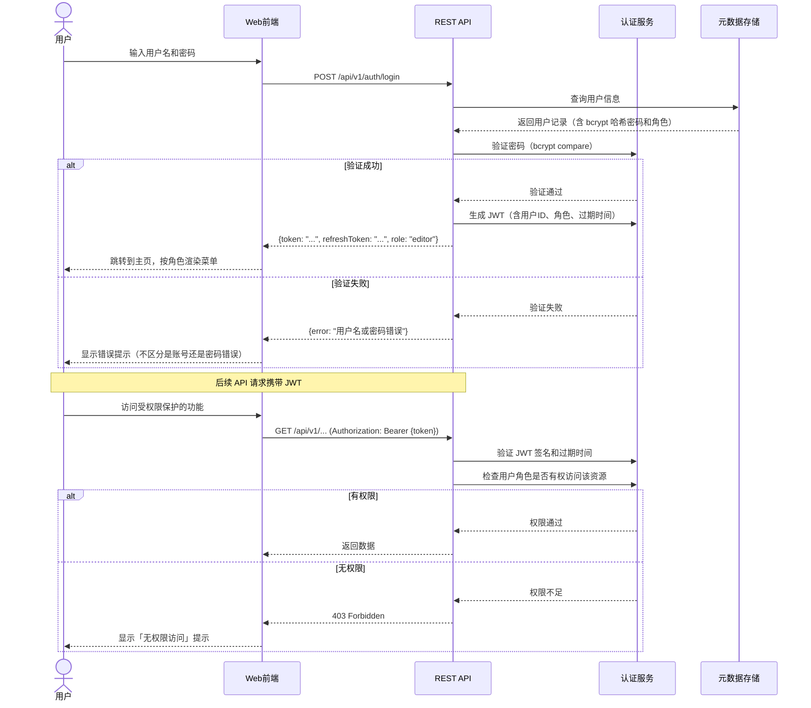

---

## 6 用例规格说明

### UC-32 可视化设计管道

| 属性 | 内容 |
|------|------|
| **用例编号** | UC-32 |
| **用例名称** | 可视化设计管道 |
| **参与者** | A1 业务分析师（Primary）、A2 数据工程师（Primary） |
| **优先级** | Must Have |
| **关联需求** | FR-B-01、FR-B-03、FR-B-04 |

**前置条件**:
- 用户已登录系统（角色为 Editor 或 Admin）
- 至少存在一个已配置的数据源
- 管道已创建（处于草稿状态）

**后置条件**:
- 管道配置已持久化保存
- 管道可进入发布或执行流程

**主成功场景**:

| 步骤 | 用户操作 | 系统响应 |
|------|---------|---------|
| 1 | 进入管道设计器 | 展示空画布，左侧节点库，右侧隐藏配置面板 |
| 2 | 从左侧拖拽「数据源」节点到画布 | 节点出现在画布，右侧弹出配置面板 |
| 3 | 在配置面板选择已有数据源，配置查询 | 节点标题更新为数据源名称，连接端口激活 |
| 4 | 拖拽一个或多个「转换」节点到画布 | 节点按类型显示不同图标 |
| 5 | 从源节点输出端口拖线到转换节点输入端口 | 连线成功，箭头显示数据流方向 |
| 6 | 配置转换节点参数 | 实时校验配置合法性 |
| 7 | 拖拽「数据目标」节点并连线 | 管道结构形成完整 DAG |
| 8 | 系统实时验证 DAG 合法性 | 右上角显示「结构正常」绿色标识 |
| 9 | 点击「保存」 | 配置持久化，Toast 提示「已保存」 |

**扩展场景**:

- **4a. 用户希望预览节点输出**:
  1. 点击节点上的「预览」按钮
  2. 系统抽取样本数据并执行到该节点的转换（最多 100 行）
  3. 在底部面板展示数据表格预览

- **8a. 管道结构存在错误（节点未连接）**:
  1. 孤立节点高亮显示红色边框
  2. 右上角显示「结构异常」红色标识
  3. 悬停显示具体错误（如「该节点未连接到管道」）
  4. 用户修正错误，错误提示消失

**异常场景**:

- **3b. 数据源连接超时（预览时）**:
  1. 显示连接超时提示
  2. 提供「重试」按钮或「更换数据源」链接

**业务规则**:

| 规则 ID | 规则内容 |
|---------|---------|
| BR-01 | 管道有且仅有一个起始节点（数据源节点），且该节点无输入端口 |
| BR-02 | 管道至少有一个终止节点（数据目标节点），且该节点无输出端口 |
| BR-03 | 不允许存在孤立节点（未连接任何连线的节点） |
| BR-04 | 连线不能形成循环（DAG 约束） |
| BR-05 | 节点间连线方向只能从上游输出端口到下游输入端口 |

**界面要求**:
- 画布支持鼠标滚轮缩放（10%~200%），缩放中心跟随鼠标位置
- 支持多选节点（Ctrl+Click 或框选）批量移动
- 支持键盘快捷键：Ctrl+Z 撤销、Ctrl+Y 重做、Delete 删除选中节点
- 节点连线支持拖拽调整弯曲路径

---

### UC-41 手动触发管道执行

| 属性 | 内容 |
|------|------|
| **用例编号** | UC-41 |
| **用例名称** | 手动触发管道执行 |
| **参与者** | A1 业务分析师（Primary）、A2 数据工程师（Primary）、S6 调度引擎（Secondary） |
| **优先级** | Must Have |
| **关联需求** | FR-E-01 |

**前置条件**:
- 用户已登录系统（角色至少为 Operator）
- 管道状态为「已发布」

**后置条件**:
- 创建一条执行记录（Run）
- 执行任务加入调度引擎队列

**主成功场景**:

| 步骤 | 用户操作 | 系统响应 |
|------|---------|---------|
| 1 | 在管道列表点击「立即执行」 | 弹出执行确认对话框（含可选参数注入） |
| 2 | 确认执行 | 提交执行请求 |
| 3 | — | 返回 Run ID，页面跳转至执行状态页 |
| 4 | 观察执行进度 | 每 3 秒刷新节点进度，显示当前执行节点高亮 |
| 5 | — | 执行成功，显示统计摘要（行数/耗时） |

**异常场景**:

- **2a. 同一管道已有执行任务在运行中（超并发限制）**:
  1. 提示「该管道当前有运行中的任务，是否仍要继续？」
  2. 用户可选择排队等待或取消

- **3b. 执行引擎队列已满**:
  1. 返回「系统繁忙，请稍后重试」提示
  2. 执行请求被拒绝，不创建 Run 记录

---

### UC-54 配置告警规则

| 属性 | 内容 |
|------|------|
| **用例编号** | UC-54 |
| **用例名称** | 配置告警规则 |
| **参与者** | A2 数据工程师（Primary）、A3 系统管理员（Primary） |
| **优先级** | Must Have |
| **关联需求** | FR-F-05、FR-F-06 |

**前置条件**:
- 用户已登录，角色为 Editor 或 Admin
- 系统 SMTP 配置已完成（邮件告警）或 Webhook URL 已可访问

**主成功场景**:

| 步骤 | 用户操作 | 系统响应 |
|------|---------|---------|
| 1 | 进入管道设置 → 告警配置 | 显示当前告警规则列表（默认无规则） |
| 2 | 点击「新增告警」 | 弹出告警类型选择：邮件 / Webhook |
| 3 | 选择「邮件告警」，填写收件人 | 显示邮件配置表单 |
| 4 | 配置触发条件（执行失败 / 数据质量异常 / 执行超时） | — |
| 5 | 点击「保存告警规则」 | 告警规则保存，列表更新 |
| 6 | 点击「发送测试通知」 | 立即发送测试邮件 |
| 7 | — | 显示「测试邮件已发送，请检查收件箱」 |

**业务规则**:
- 每个管道最多配置 10 条告警规则
- 告警静默期（同一告警 5 分钟内不重复发送）
- Webhook 请求失败后重试 3 次，超时后标记告警发送失败并记录日志

---

## 7 Phase 1 关键流程序列图（新增）

### 7.1 SFTP 文件拉取 → etl_raw 入库

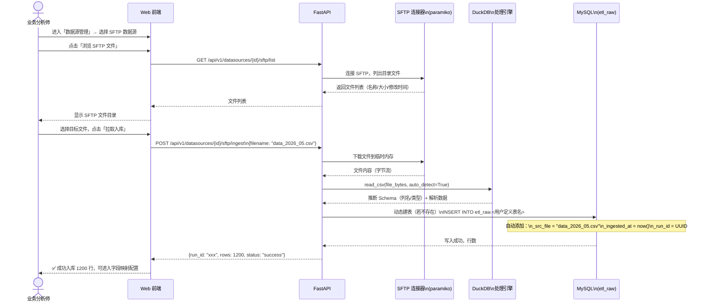

### 7.2 手动上传 CSV/Excel → etl_raw 入库

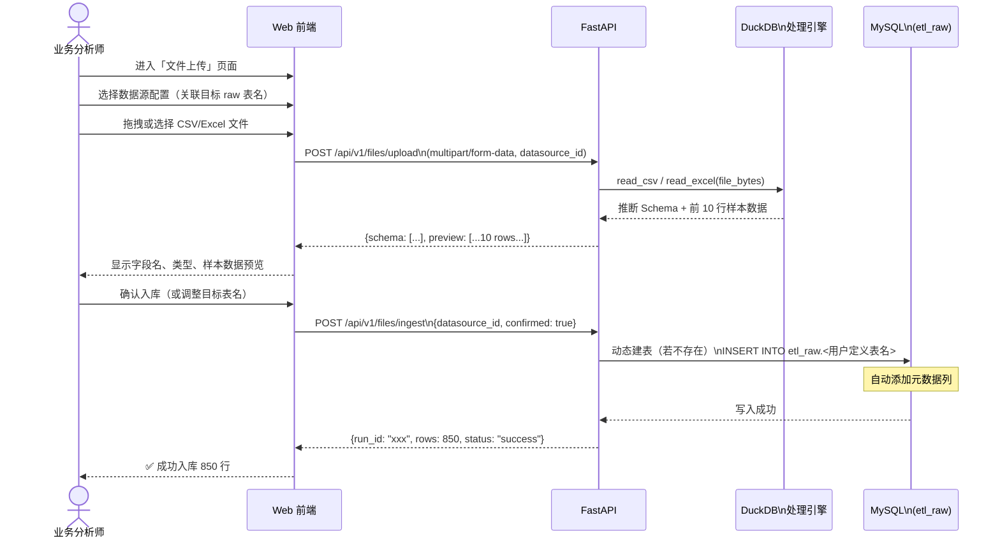

### 7.3 Raw→DWD→DWS→ADS 全链路执行

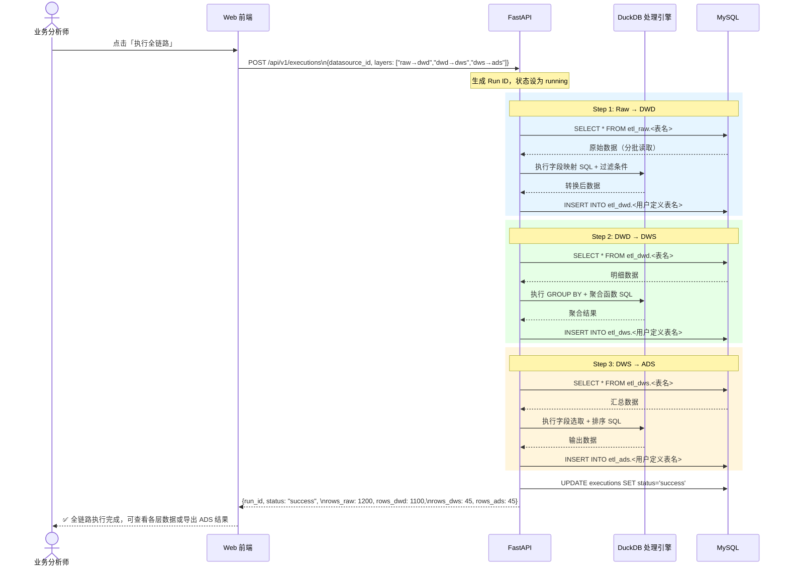
