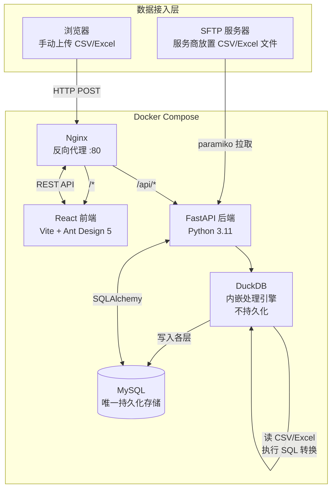

# DataETL2 系统架构文档

**版本**: v1.2.0
**日期**: 2026-05-05

---

## 变更日志

| 日期 | 版本 | 变更内容 |
|------|------|---------|
| 2026-05-05 | v1.2.0 | 更新 Docker Compose 为 5 个服务（新增 sftp 容器）；更新端口映射（:8080 非 :80）；更新关键文件路径为实际已实现文件（含✅/⬜状态标注）|
| 2026-05-04 | v1.1.0 | 新增 sftp 服务说明；新增 mysql/init.sql 说明；更新已实现路由列表 |
| 2026-05-03 | v1.0.0 | 初版创建；整体架构图、数仓分层、技术选型、表结构说明 |

---

## 1. 整体架构图



---

## 2. 数仓分层设计

所有层的表名均由用户在系统中自定义，系统不预设任何业务表名。

```
┌─────────────────────────────────────────────────────┐
│  MySQL 数据库                                         │
│                                                       │
│  etl_meta（系统元数据，固定结构）                       │
│  ├── users              用户账号                       │
│  ├── data_sources       数据源配置（含SFTP参数）         │
│  ├── field_mappings     字段映射规则                    │
│  ├── filter_rules       过滤规则                       │
│  ├── agg_rules          聚合规则（DWD→DWS）             │
│  ├── ads_rules          输出规则（DWS→ADS）             │
│  └── executions         执行历史记录                    │
│                                                       │
│  etl_raw.<用户定义表名>   原始数据层（永久保留）           │
│  ├── 原始字段（文件原样入库）                             │
│  ├── _src_file          来源文件名                      │
│  ├── _ingested_at       入库时间戳                      │
│  └── _run_id            执行批次 ID                     │
│                                                       │
│  etl_dwd.<用户定义表名>   明细数据层                     │
│  └── 字段名/类型由 field_mappings 配置决定               │
│                                                       │
│  etl_dws.<用户定义表名>   汇总数据层                     │
│  └── 字段由 agg_rules 聚合配置决定                       │
│                                                       │
│  etl_ads.<用户定义表名>   应用数据层（最终输出）           │
│  └── 字段由 ads_rules 输出配置决定                       │
└─────────────────────────────────────────────────────┘
```

### 数据流转说明

| 步骤 | 来源 | 目标 | 执行引擎 | 配置驱动 |
|------|------|------|---------|---------|
| 文件入库 | CSV/Excel 文件 | etl_raw | DuckDB `read_csv()` / `read_excel()` | data_sources.target_raw_table |
| 清洗转换 | etl_raw | etl_dwd | DuckDB SQL（字段映射 + 过滤） | field_mappings + filter_rules |
| 聚合汇总 | etl_dwd | etl_dws | DuckDB SQL（GROUP BY + 聚合函数） | agg_rules |
| 输出应用 | etl_dws | etl_ads | DuckDB SQL（字段选取 + 排序） | ads_rules |

---

## 3. 技术选型

| 层次 | 技术选型 | 版本 | Phase | 说明 |
|------|---------|------|-------|------|
| 前端框架 | React + TypeScript | 18.x | 1 | 主框架 |
| 前端构建 | Vite | 5.x | 1 | 开发服务器 + 构建 |
| UI 组件库 | Ant Design | 5.x | 1 | 表单/表格/弹窗等 |
| 后端框架 | FastAPI | 0.110+ | 1 | REST API |
| 数据校验 | Pydantic | v2 | 1 | 请求/响应模型 |
| ORM | SQLAlchemy | 2.0 | 1 | MySQL 读写 |
| 数据库迁移 | Alembic | 1.x | 1 | Schema 版本管理 |
| 数据存储 | MySQL | 8.0 | 1 | 唯一持久化存储（Docker 容器）|
| 处理引擎 | DuckDB | 1.x | 1 | 内嵌、读文件、执行转换 SQL |
| SFTP 客户端 | paramiko | 3.x | 1 | SFTP 连接/列目录/下载 |
| 凭据加密 | cryptography (Fernet) | latest | 1 | SFTP 密码加密存储 |
| 反向代理 | Nginx | 1.25 | 1 | 统一入口、静态文件 |
| 容器编排 | Docker Compose | v2 | 1 | 一键启动四个容器 |
| 可视化画布 | React Flow (xyflow) | 12.x | **2** | Phase 2 拖拽式流程设计器 |
| 调度引擎 | Prefect | 3.x | **2** | Phase 2 定时调度 + 监控 UI |

---

## 4. Docker Compose 服务清单（Phase 1）

```yaml
services:
  mysql:      # MySQL 8.0，数据存储在本地 volume，mysql/init.sql 自动建 5 个 schema 并授权
  api:        # FastAPI 后端，依赖 mysql
  frontend:   # React + Vite 构建产物，Nginx 静态托管
  nginx:      # 反向代理，:8080 统一入口（开发），/api/* → api，/* → frontend
  sftp:       # atmoz/sftp 测试 SFTP 服务器，./sftp-data 挂载为 /home/etltest/upload
```

**端口映射**：
- `:8080` → Nginx（前端 + API 统一入口，开发环境）
- `:8000` → FastAPI（直连调试用）
- `:3306` → MySQL（开发调试用，生产应关闭）
- `:2222` → SFTP 测试服务器（sftp 容器，FileZilla 等工具直连）

---

## 5. 关键文件路径

> ✅ = 已实现；⬜ = 待实现（Day 4+）

```
DataETL2/
├── docker-compose.yml              # 5 个服务：mysql / api / frontend / nginx / sftp
├── .env                            # 环境变量（MySQL 密码、JWT Secret、Fernet Key 等）
├── mysql/
│   └── init.sql                    # 自动建 etl_meta/raw/dwd/dws/ads 并授权
├── nginx/
│   └── nginx.conf
├── sftp-data/                      # 挂载到 sftp 容器，放测试文件
├── backend/
│   ├── requirements.txt
│   ├── main.py                     # FastAPI 入口，注册所有路由
│   ├── config.py                   # 环境变量读取（pydantic-settings）
│   ├── database.py                 # SQLAlchemy engine + Session
│   ├── crypto.py                   # Fernet 加解密（SFTP 密码）✅
│   ├── models/                     # SQLAlchemy ORM 模型
│   │   ├── user.py                 # ✅
│   │   ├── data_source.py          # ✅ 数据源配置（SFTP参数/目标表名）
│   │   ├── field_mapping.py        # ✅ 字段映射规则（DstType enum）
│   │   ├── filter_rule.py          # ⬜ 过滤规则（Day 4）
│   │   ├── agg_rule.py             # ⬜ 聚合规则（Day 5）
│   │   ├── ads_rule.py             # ⬜ 输出规则（Day 6）
│   │   └── execution.py            # ⬜ 执行历史（Day 4）
│   ├── routers/                    # FastAPI 路由
│   │   ├── auth.py                 # ✅ 登录/Token/Register
│   │   ├── datasources.py          # ✅ 数据源 CRUD
│   │   ├── upload.py               # ✅ 手动文件上传 + 字段预览
│   │   ├── sftp.py                 # ✅ SFTP 列目录 + 拉取入库
│   │   └── mappings.py             # ✅ 字段映射 CRUD + Excel 导入/导出
│   └── alembic/                    # Alembic 迁移脚本
│       ├── env.py
│       ├── alembic.ini
│       └── versions/
├── frontend/
│   ├── package.json
│   ├── vite.config.ts
│   └── src/
│       ├── App.tsx                 # ✅ 路由 + 布局 + 认证守卫
│       ├── api/
│       │   └── client.ts           # ✅ axios 实例（自动附带 JWT）
│       └── pages/
│           ├── Login.tsx           # ✅
│           ├── DataSources.tsx     # ✅ 数据源管理
│           ├── Upload.tsx          # ✅ 手动文件上传 + 字段预览
│           ├── SftpBrowser.tsx     # ✅ SFTP 文件浏览 + 拉取
│           └── Mappings.tsx        # ✅ 字段映射编辑器（内联表格）
└── Docs/
```

---

## 6. etl_meta 核心表结构

### data_sources（数据源配置）

| 字段 | 类型 | 说明 |
|------|------|------|
| id | INT PK | 主键 |
| name | VARCHAR(100) | 用户自定义名称 |
| description | TEXT | 描述 |
| source_type | ENUM('sftp','upload') | 接入类型 |
| sftp_host | VARCHAR(255) | SFTP 主机（加密存储）|
| sftp_port | INT | SFTP 端口，默认 22 |
| sftp_user | VARCHAR(100) | SFTP 用户名 |
| sftp_password_enc | TEXT | SFTP 密码（Fernet 加密）|
| sftp_remote_path | VARCHAR(500) | SFTP 目录路径 |
| sftp_file_pattern | VARCHAR(100) | 文件名匹配模式，如 `*.csv` |
| target_raw_schema | VARCHAR(50) | 目标 raw schema，默认 `etl_raw` |
| target_raw_table | VARCHAR(100) | 用户定义的 raw 表名 |
| created_at | DATETIME | 创建时间 |
| updated_at | DATETIME | 更新时间 |

### field_mappings（字段映射规则）

| 字段 | 类型 | 说明 |
|------|------|------|
| id | INT PK | 主键 |
| data_source_id | INT FK | 所属数据源 |
| src_field | VARCHAR(100) | 源字段名（Raw 层）|
| dst_field | VARCHAR(100) | 目标字段名（DWD 层）|
| dst_type | ENUM | 目标类型（string/int/float/date/bool）|
| default_value | VARCHAR(255) | 默认值（源字段为空时使用）|
| skip | BOOLEAN | 是否跳过（不写入 DWD）|
| sort_order | INT | 排序 |
| target_dwd_table | VARCHAR(100) | 用户定义的 DWD 表名 |

### executions（执行历史）

| 字段 | 类型 | 说明 |
|------|------|------|
| id | INT PK | 主键（即 run_id）|
| data_source_id | INT FK | 关联数据源 |
| layer_from | ENUM | 来源层（raw/dwd/dws）|
| layer_to | ENUM | 目标层（dwd/dws/ads）|
| status | ENUM('running','success','failed') | 执行状态 |
| src_file | VARCHAR(500) | 来源文件名 |
| rows_success | INT | 成功写入行数 |
| rows_failed | INT | 失败行数 |
| error_sample | JSON | 失败数据样本（最多 10 行）|
| started_at | DATETIME | 开始时间 |
| finished_at | DATETIME | 结束时间 |
| created_by | INT FK | 触发用户 |

---

## 7. 设计原则

1. **零硬编码**：系统不预设任何业务表名、字段名、数据源名称。所有业务相关的名称均由用户在界面中配置。
2. **Raw 永久保留**：etl_raw 层数据不自动删除，支持随时从原始数据重跑转换。
3. **DuckDB 透明化**：DuckDB 仅作为内存处理引擎，用户不感知其存在。所有数据的最终存储在 MySQL。
4. **凭据安全**：SFTP 密码使用 Fernet 对称加密存储，API 响应中不返回明文密码。
5. **配置驱动执行**：每次执行的转换逻辑完全由 etl_meta 中的配置生成 SQL，不依赖硬编码逻辑。

---

## 变更日志

| 日期 | 变更内容 |
|------|---------|
| 2026-05-06 | 追加变更日志节；W1-A/W1-B 新增组件（dashboards、lineage、echarts、@xyflow/react）待同步至架构图 |
| 2026-05-05 | 更新至 v1.2.0：加入执行历史、数据预览、邮件告警说明 |
| 2026-05-02 | 初始创建 |
